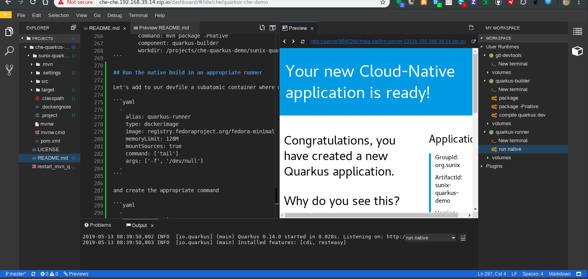

# Quarkus and Che

To run this demo:

[](http://che-che.apps.cluster-paris-67df.paris-67df.open.redhat.com/f?url=https://raw.githubusercontent.com/sunix/che-quarkus-demo/microservices/devfile.yaml)

or

```
https://<your-che-instance>/f?url=https://raw.githubusercontent.com/sunix/che-quarkus-demo/microservices/devfile.yaml
```


## Introduction
The goal of this demo is to provide a developer environment to get started in coding with Quarkus.

Let's say you would like to start the Quarkus helloworld microservice app tutorial from https://quarkus.io/guides/getting-started-guide and have generated the project.
You would like to setup your environment environment for that project.

- You need `mvn`, `GraalVM` and so on to build the project.
- You need a IDE to have the Java intellisence (code completion)
- You would like to be able to test the devmode
- You would like to perform the native compilation of the app
- You would like to test the native app in the real container that would be used in production.

This [devfile](https://github.com/sunix/che-quarkus-demo/blob/mastehttps://github.com/sunix/che-quarkus-demo/blob/master/devfile.yamlr/devfile.yaml) (to be used with Che) will provide you all the element to generate a working ready to use `devspace` :
- the che-theia IDE with a front end to code
- the project to clone: https://github.com/sunix/che-quarkus-demo/.
- a container for running the devmode, compiling the classic `java` app and compiling the native app
- a JDT LS VScode extension to have the java intellisence
- a container where to run the native app
- all the ready to use commands to perform the previous action on the right containers (devmode, package native, run native)
- a git container (to be accessed from the terminal) in case you would like to commit/push your changes somewhere.

## Setup
1. Create minishift/minikube VM
    - Demo is tested with minikube VM with 10GB memory allocated
    - Started on linux VM with the commnand:
       ```
       minikube start --vm-driver=kvm2 --extra-config=apiserver.authorization-mode=RBAC --cpus 4 --memory 10240 --docker-opt userland-proxy=false
       ```

2. Deploy Che Server to local cluster
    - Downloaded the `chectl` binary from https://github.com/che-incubator/chectl/releases and moved/renamed to your `PATH`
        ```
        chectl server:start
        ```

3. Download the devfile from https://github.com/sunix/che-quarkus-demo/blob/master/devfile.yaml locally
   (either by cloning or downloading just the raw file)

4. Create a workspace from this Devfile:

    ```
    chectl workspace:start --devfile=devfile.yaml
    ```

5. Run the workspace.


The devfile will clone this project https://github.com/sunix/che-quarkus-demo.

It is a simple helloworld quarkus project created from the Quarkus getting started
guide https://quarkus.io/guides/getting-started-guide.

The devfile will also setup few container images:
- `quarkus-builder`: based on [quay.io/quarkus/centos-quarkus-maven](https://quay.io/repository/quarkus/centos-quarkus-maven?tag=latest&tab=tags).
  It will provides all the dependencies to run quarkus in devmode and package a quarkus app:
    1. Start the quarkus app in devmode. With the right command `compile quarkus:dev`.
    2. Running it should popup windows to access to the exposed port of the app.
    3. Open the link into another tab and access to the `/hello`. It should display `hello`.
    4. Make a change on the Java file `hello-quarkus/src/main/java/com/example/QuarkusDemoResource.java`,
       use the code completion to perform a `"hello".toUpperCase();`. BEWARE, autosave may not be activated by default (File > Auto Save)
    5. Don't forget to update the test `hello-quarkus/src/test/java/com/example/QuarkusDemoResourceTest.java`
    6. Refreshing the app tab page, it should display `HELLO`
    7. Stop it : Ctrl-C
    8. Package the app into a classic java app (optional)
    9. Package the app into a tiny executable by running the native compilation `package -Pnative`, it will take a while ....
- `quarkus-runner`: which is based on `registry.fedoraproject.org/fedora-minimal`
    1. It is used to run the result of the native compilation. Show that it is very tiny `16M` !!!
    2. Once native compilation is perform you can run the command `start native`

In quarkus, we want to run the classic build with a hotspot JVM for developping.
But at some point, we also would like to be able to perform the native compilation
and run the app like it would be in production .... BEFORE PUSHING TO GIT !!!!

This devfile is providing a environment to code the Quarkus app hello world that could be used out of the box.
Developers won't have to install the right JVM and GraalVM and change their default settings.

You can talk about the fact that this environment is very close to the production but also to your CI and take the example of a CI build based on the multistage docker https://github.com/sunix/che-quarkus-demo/blob/master/Dockerfile. and https://quay.io/repository/sunix/quarkus-demo-app?tab=builds

Latest slide deck: https://docs.google.com/presentation/d/12DvTtEUT96t91t52MnFCs4Ar0XDj9XlpS8uM73n8C6Y/edit?usp=sharing


# How did I create this demo up
In this section I will describe the way I have created this demo.

## how to generate this:
Generate a empty devfile to run quarkus build
```
chectl devfile:generate --name=quarkus-che-demo --language=java --editor=theia-next --dockerimage=quay.io/quarkus/centos-quarkus-maven > quarkus.dev
file
```

Run the devfile
```
chectl workspace:start --devfile=quarkus.devfile
```

That will run a che workspace with quarkus and maven ... let's generate the project and push it.

From the theia-ide container terminal ...
```
cd /projects && git init che-quarkus-demo
```

From the quay-io-quarkus-cent terminal ....
```
cd /projects/che-quarkus-demo
mvn io.quarkus:quarkus-maven-plugin:0.14.0:create -DprojectGroupId=com.example -DprojectArtifactId=hello-quarkus -DclassName="com.example.QuarkusDemoResource" -Dpath="/hello"
```

You can try to run from the terminal
```bash
mvn compile quarkus:dev
```
It will compile the project and start quarkus:dev

Back to the theia-ide container terminal to push everything
```
cd /projects/che-quarkus-demo
git remote add sunix https://github.com/sunix/che-quarkus-demo
git checkout master
git add hello-quarkus/
git add restart_mvn_quarkus_dev.sh
git commit -s -m "quarkus java project skeleton"
git push sunix master
```

For this part I got information from https://quarkus.io/guides/getting-started-guide and https://github.com/quarkusio/quarkus-images
Also the learning portal helped me to learn a bit of Quarkus https://learn.openshift.com/middleware/courses/middleware-quarkus/.

## Enhance the devfile for the developer

Add to the devfile the project to clone and a default quarkus dev command to execute:
```
chectl devfile:generate \
    --name=quarkus-che-demo \
    --language=java \
    --editor=theia-next \
    --dockerimage=quay.io/quarkus/centos-quarkus-maven \
    --git-repo=https://github.com/sunix/che-quarkus-demo \
    --command="mvn compile quarkus:dev" \
 > quarkus.devfile

```

generates that:

```yaml
specVersion: 0.0.1
name: quarkus-che-demo
projects:
  - source:
      type: git
      location: 'https://github.com/sunix/che-quarkus-demo'
    name: che-quarkus-demo
components:
  - alias: quay-io-quarkus-cent
    type: dockerimage
    image: quay.io/quarkus/centos-quarkus-maven
    memoryLimit: 512M
    mountSources: true
    command:
      - tail
    args:
      - '-f'
      - /dev/null
  - type: chePlugin
    alias: java-ls
    id: redhat/java/0.38.0
  - type: cheEditor
    alias: theia-editor
    id: eclipse/che-theia/next
commands:
  - name: 'mvn compile quarkus:dev'
    actions:
      - type: exec
        command: 'mvn compile quarkus:dev'
        component: quay-io-quarkus-cent
        workdir: /projects/che-quarkus-demo

```

Let's give more memory to the java language server:
```yaml
  - type: chePlugin
    alias: java-ls
    id: redhat/java/0.43.0
    memoryLimit: 1536M
```

And add a git dockerimage because it is so conveniant to do `git add -p` :) and use `tig`
```yaml
  -
    alias: git-devtools
    type: dockerimage
    image: sunix/git-devtools
    mountSources: true
    memoryLimit: 256M
    command: ['tail']
    args: ['-f', '/dev/null']
```


Last change: share the .m2 repo for the volume to both builder and the java plugin so they share the same repo

*beware, this may not work yet https://github.com/eclipse/che/issues/13318*
```yaml
  - alias: quay-io-quarkus-cent
    type: dockerimage
    image: quay.io/quarkus/centos-quarkus-maven
    memoryLimit: 512M
    mountSources: true
    command: ['tail']
    args: ['-f', '/dev/null']
    volumes:
      - name: mavenrepo
        containerPath: /root/.m2
  - type: chePlugin
    alias: java-ls
    id: redhat/java/0.43.0
    memoryLimit: 2Gi
    volumes:
      - name: mavenrepo
        containerPath: /root/.m2
```

Creating a workspace from that devfile, you should be able to get commands from the `My workspace` view and start the quarkus dev mode. Changing the quarkusdemoresource.
accessing to the application. Openning `QaurkusDemoResource.java` should openned the editor with the fully functional editor and java intellisence.

## Packaging ...

Let's continue improving our devfile, we want to be able to package the app and run the native build.

I have renamed the component `quay-io-quarkus-cent` to `quarkus-builder`, gave it a bit more memory (native compilation needs more). Also renamed the command to `compile quarkus:dev`
```yaml
  - alias: quarkus-builder
    type: dockerimage
    image: quay.io/quarkus/centos-quarkus-maven
    memoryLimit: 2Gi
    mountSources: true
    args: ['-f', '/dev/null']
    volumes:
      - name: mavenrepo
        containerPath: /root/.m2
```
and component reference in the command. I have also change the folder where the command is going to be executed:
```yaml
commands:
  - name: compile quarkus:dev
    actions:
      - type: exec
        command: pkill java; mvn compile quarkus:dev
        component: quarkus-builder
        workdir: /projects/che-quarkus-demo/hello-quarkus
```

Let's add a new command to perform `mvn package` and `mvn package -Pnative` (for native compilation optimized with GraalVM) and the command to kill the quarkus devmode:

```yaml
commands:
  - name: pkill java
    actions:
      - type: exec
        command: pkill java
        component: quarkus-builder

  - name: package
    actions:
      - type: exec
        command: mvn package
        component: quarkus-builder
        workdir: /projects/che-quarkus-demo/hello-quarkus

  - name: package -Pnative
    actions:
      - type: exec
        command: mvn package -Pnative
        component: quarkus-builder
        workdir: /projects/che-quarkus-demo/hello-quarkus
```

Relaunching a new workspace from it, we should be able to to run the native Quarkus compilation and produce the executable. Basically followed https://quarkus.io/guides/building-native-image-guide.

To recap, my devfile looks like:

```yaml
specVersion: 0.0.1
name: quarkus-che-demo

projects:

  - source:
      type: git
      location: 'https://github.com/sunix/che-quarkus-demo'
    name: che-quarkus-demo

components:

  - alias: quarkus-builder
    type: dockerimage
    image: quay.io/quarkus/centos-quarkus-maven
    memoryLimit: 2Gi
    mountSources: true
    command: ['tail']
    args: ['-f', '/dev/null']
    volumes:
      - name: mavenrepo
        containerPath: /root/.m2

  - alias: quarkus-runner
    type: dockerimage
    image: registry.fedoraproject.org/fedora-minimal
    memoryLimit: 56M
    mountSources: true
    command: ['tail']
    args: ['-f', '/dev/null']

  - type: chePlugin
    alias: java-ls
    id: redhat/java/0.43.0
    memoryLimit: 1536M

  - alias: git-devtools
    type: dockerimage
    image: sunix/git-devtools
    mountSources: true
    memoryLimit: 256M
    command: ['tail']
    args: ['-f', '/dev/null']

  - type: cheEditor
    alias: theia-editor
    id: eclipse/che-theia/next

commands:
  - name: compile quarkus:dev
    actions:
      - type: exec
        command: pkill java; mvn compile quarkus:dev
        component: quarkus-builder
        workdir: /projects/che-quarkus-demo/hello-quarkus

  - name: pkill java
    actions:
      - type: exec
        command: pkill java
        component: quarkus-builder

  - name: package
    actions:
      - type: exec
        command: mvn package
        component: quarkus-builder
        workdir: /projects/che-quarkus-demo/hello-quarkus

  - name: package -Pnative
    actions:
      - type: exec
        command: mvn package -Pnative
        component: quarkus-builder
        workdir: /projects/che-quarkus-demo/hello-quarkus

```

## Run the native build in an appropriate runner

Let's add to our devfile a subatomic container where we are going to run our freshly built subatomic Java app

```yaml
  -
    alias: quarkus-runner
    type: dockerimage
    image: registry.fedoraproject.org/fedora-minimal
    memoryLimit: 128M
    mountSources: true
    command: ['tail']
    args: ['-f', '/dev/null']
  -
```

and create the appropriate command

```yaml
  -
    name: run native
    actions:
      - type: exec
        command: ./hello-quarkus-1.0-SNAPSHOT-runner -Dquarkus.http.host=0.0.0.0
        component: quarkus-runner
        workdir: /projects/che-quarkus-demo/hello-quarkus/target
```

